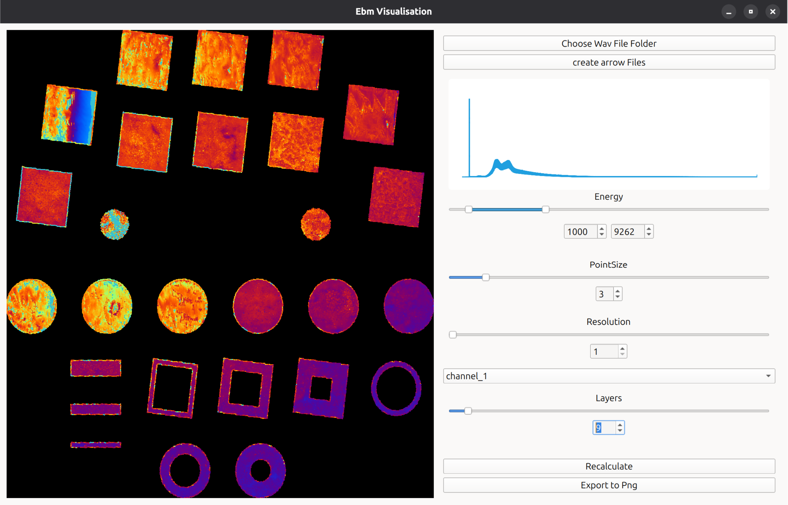

## Visualization Software for Wave Files in a Ebm Context.

It is specifically designed to run with as few RAM as possible. 
Every calculation is done with [polars](https://pola.rs/) or directly through opengl.

### how does it work

We use arrow files to get the fastest polars speed. When the wav files are converted to arrow files we take the x,y channels and the four sensor channels. The conversion is generally pretty fast but since it isnt running on a seperate thread yet it will probably brick the application for a while depending on the amount of files and file size.
The theoretical largest file is: (RAM - samplerate * length of file * 12) > 0.
The is the amount of data which is passed to opengl. The 12 is calculated from bytesize per sample (float32) and the number of channels (3). This implies that we actually take every sample. We can adjust the resolution to reach the desired number.

### Installation

step 1
Create the virtual Environment. Here ill call it venv.
python -m venv venv
If you get an error make sure venv is installed.

step 2
activate the venv
source venv/bin/activate

step 3
install requirements
pip install -r requirements.txt

step 4 
run software
python main.py

### How to use

It expects arrow files inside the folder: arrow_files
If you start the Application for the first time press on the "choose wav folder" button.
After that press "convert to arrow files". As soon as the application is responding again(ill fix that one later)
you should be able to press the recalculate button. The animation suggests a calculation which takes time.
Changing channels or layers takes a call to polars while adjusting the energy range only talks to opengl which is basically instant.

### Whats planned

- Addition of Channel options so we can choose the mean of all. Other ideas wellcome.
- Implementation of a Watchdog. This would enable us to choose a folder which is continually watched. The end goal is to use it during the melt itself.
- Implement a range slider for layers. The layer slider should be able to work like the energy slider.
- 3D? well see...

All animations by: [HEnYpHOs](https://www.tumblr.com/ruskyart)
