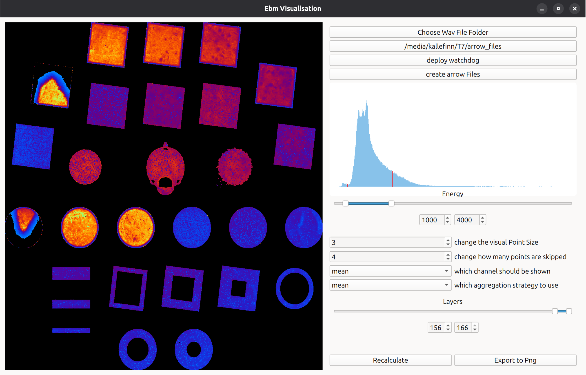

## Visualization Software for Wave Files in a Ebm Context.

It is specifically designed to run with as few RAM as possible. 
Every calculation is done with [polars](https://pola.rs/) or directly through opengl.

### how does it work

We use arrow files to get the fastest polars speed. When the wav files are converted to arrow files we take the x,y channels and the four sensor channels.
The theoretical largest file is: (RAM - samplerate * length of file * 12).
The is the amount of data which is passed to opengl. The 12 is calculated from bytesize per sample (float32) and the number of channels (3). This implies that we actually take every sample. We can adjust the resolution to reach the desired number.

### Installation

step 1
Create the virtual Environment. Here ill call it venv.
python -m venv venv
If you get an error make sure venv is installed.

step 2
activate the venv
source venv/bin/activate

step 3
install requirements
pip install -r requirements.txt

step 4 
run software
python main.py

### How to use

During the Melt:
    
    Choose the wav folder where the ebm will send the data.
    Choose a folder where you want to store the arrow files. This can be any folder and the files can also get deleted afterwards when youre done.
    Activate the Watchdog. this will monitor the wav file folder for changes and recalculate the image when new wav files appear.
    If you have to stop the melt, for whatever reason, just leave the watchdog running. There shouldnt be anything to do inside the visualizer for that occasion, just let it observe.
    The watchdog always picks the last 10 layers to aggregate on top of each other and will overwrite your last input if a file change is detected. Be aware that more than 10 layers can get pretty rough on the memory. its optimized in that regard as much as possible but best to tread lightly and increase the number of skipped points before rendering over 50 layers. Changing the value of anything appart from the energy range and the point size will need recalculation and therefore take a while to compute. 
Since it hasnt been thoroughly tested during the melting process yet, we only evaluate every second point of the data. This is to ensure memory doesnt become an issue too fast.

### Whats planned

- 3D? well see...

All animations by: [HEnYpHOs](https://www.tumblr.com/ruskyart)
